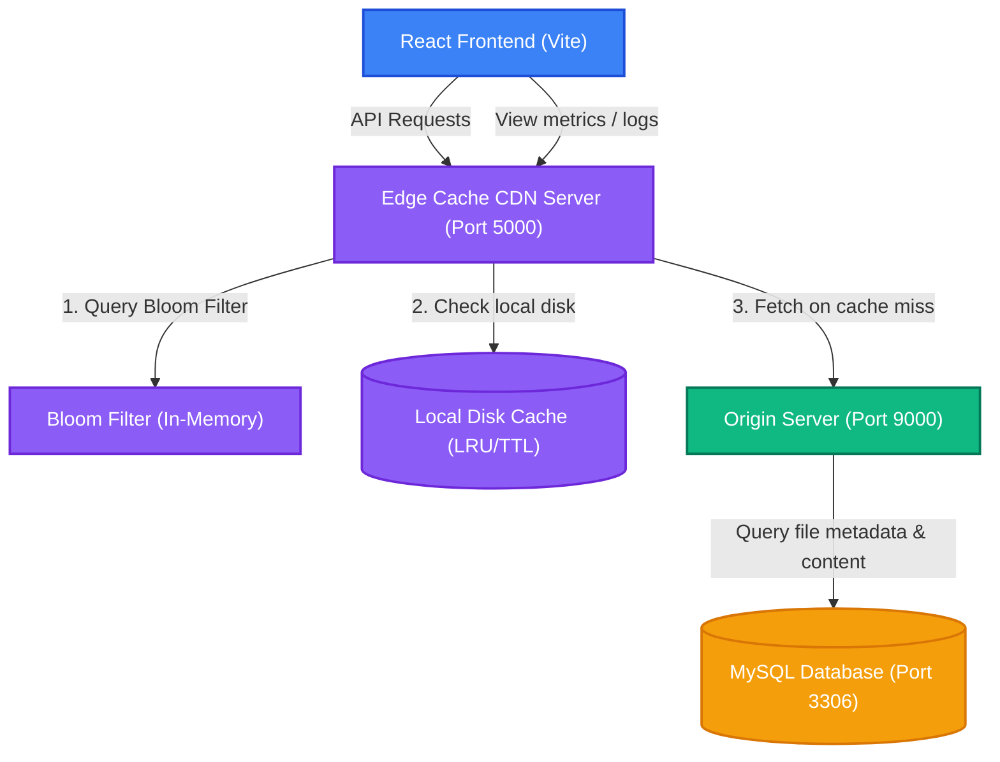
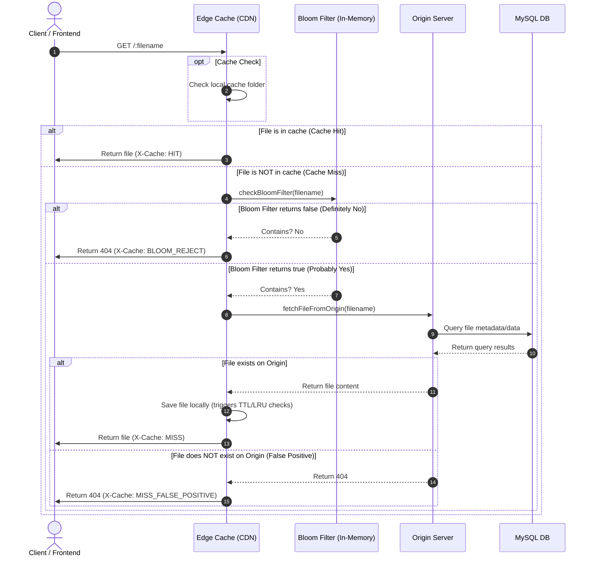

# EdgeCache CDN: Simulator & Architectural Overview

Welcome to the **EdgeCache CDN Simulator**, a full-stack, local-first simulation of a Content Delivery Network (CDN) Edge Cache Proxy server. This project demonstrates how CDN servers optimize content delivery, reduce latency, and leverage advanced probabilistic data structures like **Bloom Filters** to prevent origin server overload (anti-cache-penetration).

---

## 🏗️ System Architecture

The simulator consists of four main components running in docker containers, communicating over a local virtual network:



1. **React Frontend (Vite)**: A dashboard to request files, view request resolution logs, see real-time latency stats, flush caches, rebuild filters, and upload files.
2. **Edge Cache Server (Port 5000)**: The CDN caching layer. It intercepts client requests, checks its local cache and Bloom Filter, and serves requests or routes misses to the Origin.
3. **Origin Server (Port 9000)**: The source-of-truth asset server that queries the MySQL Database for files and responds to the caching layer.
4. **MySQL Database (Port 3306)**: Stores original files and their metadata.

---

## 🔄 Request Flow Pipeline

When a request for a file is received by the Edge Cache, the request is processed through the following pipeline:



---

## 🛠️ Key Technical Features

### 1. Custom Bloom Filter
To prevent **Cache Penetration Attacks** (where attackers request random non-existent files to bypass caches and hammer the database), we implemented an in-memory Bloom Filter using:
- **FNV-1a Hash**: A fast 32-bit non-cryptographic hash for base hashing.
- **Polynomial Rolling Hash**: A secondary independent hash function.
- **Kirsch-Mitzenmacher Optimization**: Generates $k$ independent hash indices using only the two base hash functions:
  $$\text{index}_i = (\text{hash}_1 + i \times \text{hash}_2) \pmod m$$
  This avoids the CPU overhead of computing multiple cryptographic hashes.

### 2. Intelligent Cache Eviction Policies
The Edge Cache runs background cleanup checks every 10 seconds enforcing:
- **Time-to-Live (TTL)**: Files older than the configured TTL (e.g., 300s) are automatically evicted.
- **Least Recently Used (LRU)**: When cache size exceeds limits (e.g., 10MB), files are sorted by their last-access/touch times (`atime`/`mtime`) and the oldest are pruned first.

### 3. Case-Insensitive Gitignore Standardization
All `.gitIgnore` files were updated to standard `.gitignore` format to guarantee uniform cross-platform behavior.

### 4. Git History Sanitization
Accidentally pushed environment configurations (`.env`) were purged from the entire repository commit history using `git filter-branch` to protect sensitive database passwords and configuration keys.

---

## 🚀 Getting Started

### Prerequisites
- Docker & Docker Compose
- Node.js (if running locally without Docker)

### Run with Docker Compose

1. Clone this repository to your local directory.
2. Run the compose script to build and bring up the system:
   ```bash
   docker-compose up --build
   ```
3. Open your browser and navigate to:
   - **Frontend Dashboard**: `http://localhost:5173`
   - **Edge Cache API**: `http://localhost:5000`
   - **Origin Server API**: `http://localhost:9000`

---

## 📂 Project Directory Structure

```
EdgeCache/
├── backend/
│   ├── src/
│   │   ├── config/             # Database and Env configurations
│   │   ├── controllers/        # Express route handlers
│   │   ├── routes/             # API Router definitions
│   │   ├── services/           # Cache and Origin core services
│   │   ├── utils/              # Bloom filter, file utils
│   │   ├── origin.js           # Origin server bootstrap
│   │   └── server.js           # CDN server bootstrap
│   ├── Dockerfile
│   └── package.json
├── frontend/
│   ├── src/
│   │   ├── components/         # Metrics, Logs, Simulators UI components
│   │   ├── App.jsx             # Main Application screen
│   │   └── index.css           # Styling system
│   ├── Dockerfile
│   └── package.json
├── docker-compose.yml          # Container configuration orchestrator
└── .gitignore                  # Global untracked exclusions
```
